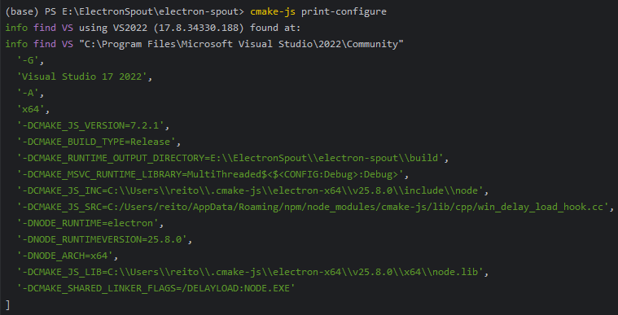

# Electron Spout

Share [Electron](https://github.com/electron/electron)'s offscreen window's frame to [Spout](https://github.com/leadedge/Spout2) output.

It listens to `paint` event and copies the frame data, sends to native module, copies to D3D11Texture2D and share.

## Build

1. Update the info in `package.json` according to your electron version. 
   
   > Set `arch` to `x86` if your project is targeting 32-bit.

    ```json
    { 
      "cmake-js": {
        "runtime": "electron",
        "runtimeVersion": "30.0.1",
        "arch": "x64"
      }
    }
    ```

2. Run `cmake-js print-configure` to get CMake configuration. 

    

3. Copy these arguments and set these variables to CMake options.
   > Warning: You must change `-DCMAKE_MSVC_RUNTIME_LIBRARY` to `MultiThreaded$<$<CONFIG:Debug>:Debug>DLL` because we link Spout statically.
   
   ```
   -G "Visual Studio 17 2022" -A x64
   -DCMAKE_BUILD_TYPE=Release
   -DCMAKE_JS_VERSION=7.2.1
   -DCMAKE_MSVC_RUNTIME_LIBRARY=MultiThreaded$<$<CONFIG:Debug>:Debug>DLL
   -DCMAKE_JS_INC=C:/Users/reito/.cmake-js/electron-x64/v25.8.0/include/node
   -DCMAKE_JS_SRC=C:/Users/reito/AppData/Roaming/npm/node_modules/cmake-js/lib/cpp/win_delay_load_hook.cc
   -DNODE_RUNTIME=electron
   -DNODE_RUNTIMEVERSION=25.8.0
   -DNODE_ARCH=x64
   -DCMAKE_JS_LIB=C:/Users/reito/.cmake-js/electron-x64/v25.8.0/x64/node.lib
   -DCMAKE_SHARED_LINKER_FLAGS=/DELAYLOAD:NODE.EXE
   ```
   
   > There are environment dependent values, do not directly copy the text above, and always use the value provided by the command.
   
4. Build and use the .node file in your project

## Usage

```js
let win = new BrowserWindow({
   title: "MyWindow",
   webPreferences: {
      preload,
      offscreen: true,
      offscreenUseSharedTexture: true
   },
   show: false,
   transparent: true
});

const spout = require("electron_spout.node");
const osr = new spout.SpoutOutput("Electron Output");

win.webContents.setFrameRate(60);
win.webContents.on("paint", (event, dirty, image, texture) => {
   if (texture) {
      // when offscreenUseSharedTexture = true
      osr.updateTexture(texture)
   } else {
      osr.updateFrame(image.getBitmap(), image.getSize());
   }
});
```
